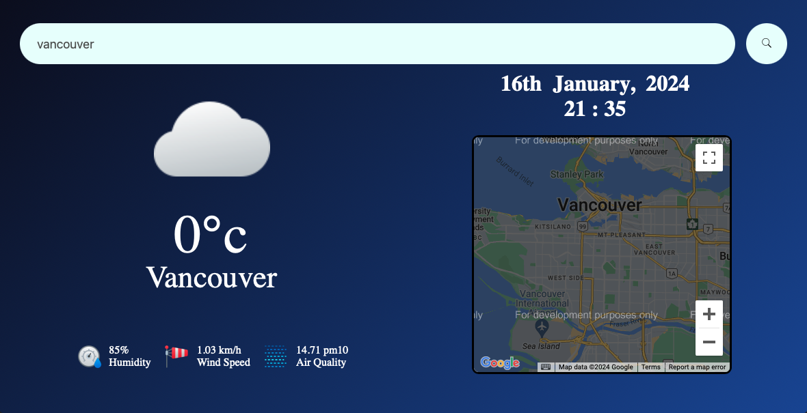

### Tech

- HTML
- CSS
- JavaScript

### Sources

- [Weather and Air Quality API](https://openweathermap.org/)
- [Icons](https://icons8.com/)

### Features

- Displayed weather data, air quality, and location
- Displayed icons based on the weather
- Background changes based on sunrise and sunset times
- Displayed an error message if an unknown city is requested

